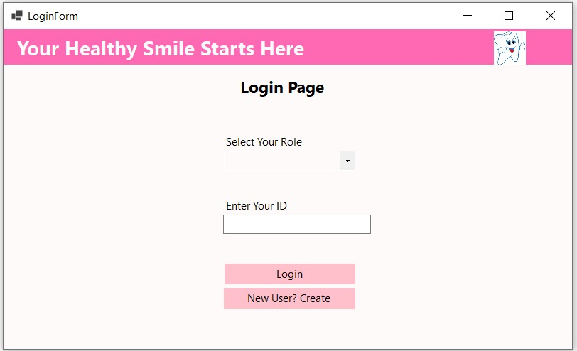
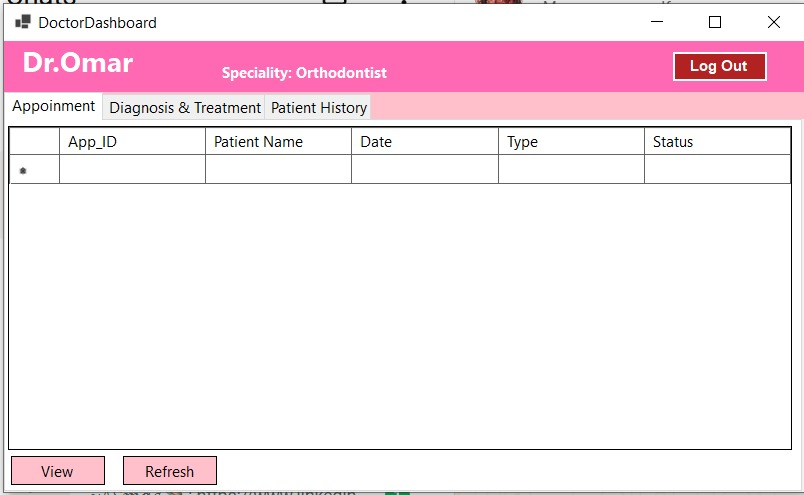

# 🦷 Dental Clinic Management System

## 📝 Overview
A professional Desktop Application designed to streamline dental clinic operations. This system manages the workflow between **Doctors**, **Patients**, and **Receptionists** through a robust and secure database architecture. It ensures data integrity and provides a user-friendly interface for managing medical records and appointments.

---

## 🚀 Key Modules & Features

### 👨‍⚕️ Doctor Dashboard
- View real-time daily schedules and assigned appointments.
- Manage comprehensive patient medical history and diagnoses.
- Issue and track digital prescriptions.

### 👩‍💼 Receptionist Dashboard
- Efficiently manage appointment slots and waiting lists.
- Register new patients and maintain up-to-date profiles.
- Monitor billing, patient payments, and generate financial summaries.

### 👤 Patient Portal
- Interactive booking system to select doctors and available slots.
- Access personal medical history and past prescription records.
- Self-management of personal profile and contact information.

---

## 🛠 Technical Highlights

- **Database Integrity & Security:**
  - Heavy use of **Stored Procedures** for all DML operations (Insert, Update, Delete) to prevent SQL Injection and centralize business logic.
  - Implementation of **SQL Transactions** (Commit/Rollback) to ensure Atomicity, especially during multi-table updates (e.g., updating patient profile and phone numbers simultaneously).
  - Advanced SQL Constraints (CHECK, UNIQUE, Foreign Keys) to maintain high-quality data.

- **Software Architecture:**
  - Built using **ADO.NET Disconnected Architecture** with `SqlDataAdapter` and `DataTable` for efficient data handling and reduced server load.
  - **Modular UI Design:** Leveraged **Panels**, **Anchors**, and **Docking** properties in WinForms to create a responsive layout that adapts to different screen resolutions.

---

## 🗄️ Database Setup
The system is powered by a relational SQL Server database. You can find the complete database setup script—including table schemas, constraints, and stored procedures—in the `/Database` folder.

- **Setup File:** [ClinicDB_Setup.sql](./Database/ClinicDB_Setup.sql)
- **Instructions:** Run the script in SQL Server Management Studio (SSMS) and update the `ConnectionString` in `App.config`.

---

## 📸 Screenshots

  
  

  
  

  <em>Comprehensive interfaces for secure authentication, patient management, and clinical workflows.</em>

---

## 👥 Project Team
Developed as part of the Computer Engineering & Software Systems curriculum at **Ain Shams University**:
- **Shahinda Gamal** ([@shahy23](https://github.com/shahy23)) -Team Member

- [Mohamed Amged - Team Member]
- [Fatma Wael - Team Member]
- [Rahma Yosry - Team Member]
- [Ans Ashraf - Team Member]

---
